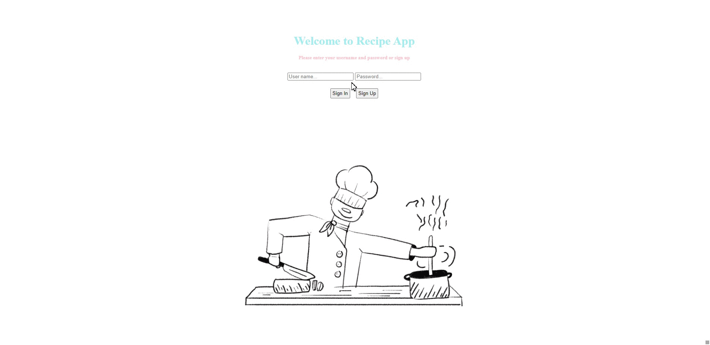
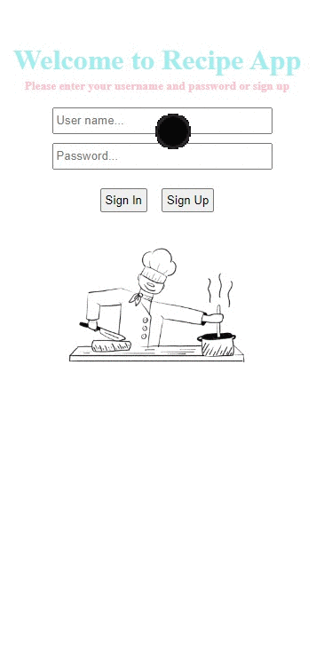

# Recipe App with styled-component

## Description

Project aims to create a Recipe App via Reacts styled-component and React router.

## Project Skeleton

```
Recipe App (folder)
|
|----readme.md        
├── public
│     └── index.html
├── src
│    ├── components
|    |     |── About
|    |     |     └── About.jsx
|    |     |     └── About.styled.jsx
|    |     |── Error
|    |     |     └── Error.jsx
|    |     |     └── Error.styled.jsx
│    |     ├── Ingredients
|    |     |     └── Ingredients.jsx
|    |     |     └── Ingredients.styled.jsx
|    │     ├── Login
|    |     |    └── Login.jsx
|    |     |    └── Login.styled.jsx
│    |     ├── recipeData
|    |     |    └── recipeData.jsx
|    |     |    └── recipeDataStyled.jsx
|    |     └── recipes.jsx
│    ├── recipes.styled.jsx
│    ├── App.js
│    └── index.js
|
├── package.json
└── yarn.lock
```


## Objective

Build Recipe Application using ReactJS with styled component.

### At the end of the project, following topics are to be covered;

- HTML

- CSS

- JS

- ReactJS

- ReactJS react router

- ReactJS styled component


### At the end of the project;

- Improve coding skills within HTML & CSS & JS  & ReactJS & ReactJS styled component  & ReactJS router. UseEffect, useState, useLocation, useNavigate hooks are used in the project.

- Use git commands (push, pull, commit, add etc.) and Github as Version Control System.

🔗 <b>To see live version<b> 🎯https://recipeapp-styled-component-with-react.netlify.app


**<p align="center">&#9786; Happy Coding &#9997;</p>**

<br><br>
🌐 The desktop and mobile versions of the web page are as follows;🧭
<br><br>

## 🖥️Desktop version
<br>

<br>
<br>
<br>
<br>
<br>
<br>
<br>
<br>
<br>
<br><br><br><br><br><br><br><br><br>


## 📱Mobile version
<br>

<br>
<br>
<br>
<br>
<br>
<br>
<br>
<br>
<br>
<br><br><br><br><br><br><br><br><br>


